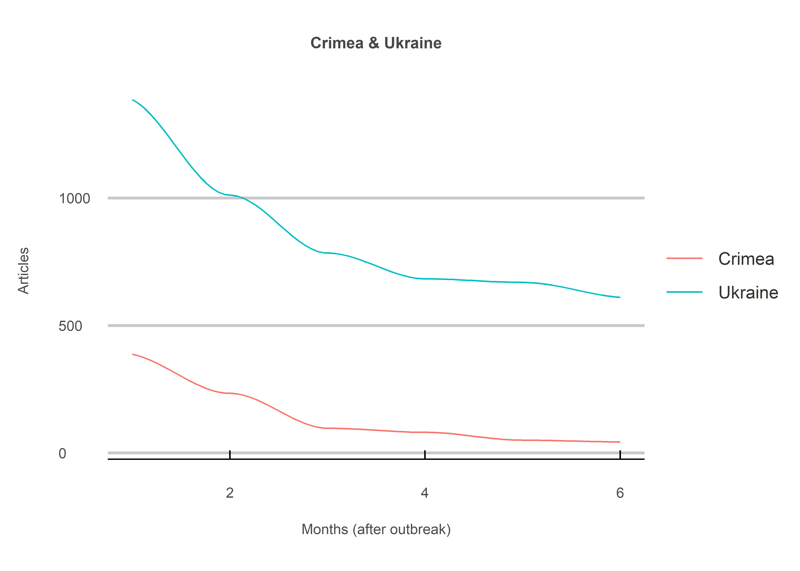
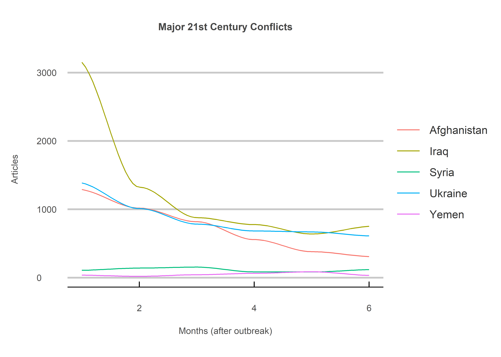

Lest We Forget
================
Jack Carter
10/26/2022

## **Summary**

This project analyses the number of New York Times articles referencing
Ukraine in the 6 months after the start of the conflict. As depicted in
the 1918 movie Lest We Forget, war is gruesome and good at grabbing our
attention - at least to begin with.

 

## NYT Articles

The number of articles mentioning Crimea and Ukraine six months after
the conflict (2014 and 2022) declines considerably.

<!-- -->

 

As we can see, the trend holds true for several other major 21st century
conflicts. Interestingly, civil wars not directly involving a great
power get hardly any attention, despite a comparably high number of
casualties.

<!-- -->

 

## **Method**

### **1) Get start & end dates:**

Six start and end dates were created for each conflict by taking a
single start date and adding months (and years if needed) iteratively to
create the needed dates.

—EXAMPLE CODE SNIPET—

``` r
# gets start and end dates. 
get_dates <- function(date, months, label, end = FALSE) {
  
  # creates separate objects for year, month and day. 
  year <- as.numeric(substr(date, 1, 4))
  month <- as.numeric(substr(date, 5, 6))
  day <- as.numeric(substr(date, 7, 8))
  
  # gets the end dates if the end parameter is marked TRUE. 
  if(end==TRUE) {
    month <- month + 1
    day <- day - 1
  }
  
  # limits days to 28 to deal with shorter months (like February). 
  if(day > 28) day <- 28
  
  # loops through the start dates and updates and resets the
  # the month and years if the month count goes over 12. 
  dates <- list()
  for(i in 1:months) {
    if(month >= 13) {
      year <- year + 1
      month <- 1
    }
    
    # assigns i start dates while pasting an extra zero before those 
    # months and days less than 10 (i.e. 9 - (only has 1 digit)). 
    if(month >= 10 & day >= 10) {
      dates[i] <- as.numeric(paste0(year, month, day)) 
      month <- month +1
    } else if(month >= 10 & day < 10) {
      dates[i] <- as.numeric(paste0(year, month, paste0(0,day))) 
      month <- month +1
    } else if(month < 10 & day >= 10) {
      dates[i] <- as.numeric(paste0(year, paste0(0,month), day)) 
      month <- month +1
    } else {
      dates[i] <- as.numeric(paste0(year, paste0(0,month), paste0(0,day))) 
      month <- month +1
    }
  }
  return(unlist(dates))
}
```

 

### **2) Get Hits:**

The number of articles for a specific conflict and start/end date
combination were collected through the New York Times (NYT) API.

—EXAMPLE CODE SNIPET—

``` r
# find out how many results are returned for a given term and date range.  
get_hits_data <- function(start_dates, end_dates, terms) {
  url <- paste0("http://api.nytimes.com/svc/search/v2/articlesearch.json?q=%22",
                terms,
                "%22&begin_date=",
                start_dates,
                "&end_date=",
                end_dates,
                "&facet_filter=true&api-key=",
                nyt_key, 
                sep="")
  # query. 
  results_counter <- 1L
  results <- list()
  search <- repeat{try({query <- fromJSON(url, flatten = TRUE)})
    # error handling. 
    if(exists("query")) {
      results <- query
      rm(query)
      break 
    } else {
      if(results_counter <= 45L) {
        message("Re-trying query: attempt ", results_counter, " of 45.")
        results_counter <- results_counter +1L
        Sys.sleep(1)
      } else {
        message("Retry limit reached: initial query unsuccessful.")
        break
      }
    }
  }
  return(results$response$meta$hits)
}
```

 

### **3) Get All Hits:**

The number of hits for all of the conflict and start/end date
combinations were collected and put into a single dataframe to be
visualized

—EXAMPLE CODE SNIPET—

``` r
# loops through each start/end date. 
get_all_hits <- function(start_dates, end_dates, month, terms) {
  
  list <- list()
  for(i in 1:length(terms)){
    
    message("Month ", i, " of ", length(start_dates))
    
    list[[i]] <- tibble(Hits = get_hits_data(start_dates[i], end_dates[i], terms[i])) %>%
      mutate("War" = terms[i],
             "Month" = month[i])
    
    Sys.sleep(10)
  }
  return(tibble(rbind_pages(list)))
}
```

 

## **Sources**

  - NYT (2022) <https://developer.nytimes.com/>

  - Fitzgerald (2018)
    <https://www.storybench.org/working-with-the-new-york-times-api-in-r/>
